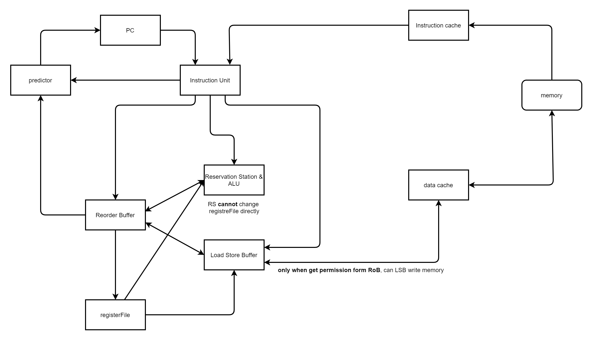

## Components

### cache

Cache 由 Instruction cache & data cache 组成. 

注意memory不直接与其它组件沟通，其中Instruction cache只可读，data cache可读可写。 

### Instruction Unit

与其它组件的关系较为复杂，此处分几块进行说明. 

1. 与PC的关系，PC指导Instruction Unit去什么地址取指令.取指令完成之后，如果不是分支指令，PC会自动加4;
如果是分支指令，Instruction Unit先将指令的特征序列传递给Predictor，之后PC会根据Predictor的结果进行跳转.

2. 与RoB的关系：如果RoB尚未满， Instruction Unit会将相关指令信息传递给RoB， 为生成当前RoBRow作一定铺垫

3. 与RS和LSB的关系： 如果指令是Load/Store指令，Instruction Unit会将相关指令信息传递给LSB， 为生成当前LSBRow作一定铺垫；否则，Instruction Unit会将相关指令信息传递给RS， 为生成当前RSRow作一定铺垫

### Reservation Station & ALU

主要是与RoB的关系

1. 取指令阶段， RS中的RSRow需要保留下其对应的在RoB中的index, 以便在执行阶段，将结果写入RoB中对应的RoBRow;同时 RS需要从RegisterFile中获取寄存器占有以及依赖情况写入当前RSRow
2. 每个时钟周期结束之后，RS会根据RoB中的ready依次更行每个RSRow的依赖情况， 如果RSRow两项依赖均被满足， 则将其标记为ready
3. 每个时钟周期，从前往后扫描，如果遇到第一个已经ready但是还没有进行计算的RSRow,RS将需要计算的值传递给ALU，在ALU计算结束之后RS将对应的RoBRow的ready置为true，同时将计算结果value传递给RoB

特别需要注意的是，RS是不能直接修改RegisterFile的，只能通过RoB来间接修改RegisterFile。 

### Load Store Buffer
1. 取指令阶段， RS中的RSRow需要保留下其对应的在RoB中的index, 以便在执行阶段，将结果写入RoB中对应的RoBRow;同时 RS需要从RegisterFile中获取寄存器占有以及依赖情况写入当前RSRow
2. 每个时钟周期结束之后，LSB会根据RoB中的ready依次更行每个RSRow的依赖情况， 如果RSRow两项依赖均被满足**且LSB中的type不是memory write** 则将其标记为ready
3. 每个时钟周期检查队头,如果已经ready，则进行如下分类讨论：（i）若为memory read操作，则将对应的RoBRow的ready置为true，同时将读cache得到的value传递给RoB
（ii）若为memory write操作，由于其已经ready，后续介绍RoB组件时可以得知这个memory write相当于已经经过了RoB的许可，LSB直接修改对应的data cache

### Reorder Buffer

上述已经说明的关系此处不重复说明，故只需要说明执行指令的时候RoB与其它组件的关系即 
每个时钟周期检查队头，若其ready为true，则根据RoBRow中的type来分类讨论： 

1. 如果是registerWrite，则RoB对RegisterFile进行修改
2. 如果是memoryWrite，则RoB对将对应的LSBRow中的ready置为true
3. 如果是branch，则首先RoB将正确的需要跳转的地址传递给predictor，然后检查，如果之前predictor给出的是错误的分支，则对所有组件执行clear操作
4. 如果是end，则终止整个体系的运行

### Others
诸如RegisterFile, Predictor, Memory, PC等组件与其它组件的关系较为简单，已经被上述组件的说明所覆盖，此处不再赘述 